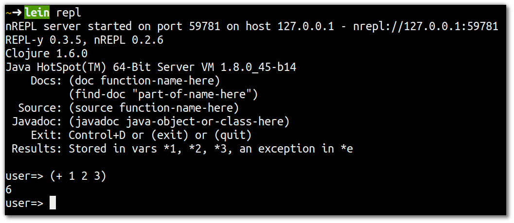

# Run the REPL

  The **REPL** (Read, Evaluate, Print Loop) is the runtime environment for Clojure.  The REPL evaluates your code and returns a result.  You can evaluate a whole project or just a single expression.  An **expression** is Clojure code contained within `()`.  You can also evaluate symbols, numbers, strings, etc.

>  **Note** From the root of your project directory, run the following command 
  
```shell
lein repl
```

  Check the REPL works with some simple maths. At the REPL prompt, **user=>**, enter the following code and press the return key
  
```clojure
(+ 1 2 3)
```

  The Clojure REPL should return the value `6`
  


> **Hint** The user=> prompt is telling you what namespace the REPL is currently running in, by default this is `user`.  The => are characters representing the prompt, just like you get on the command line.

> If you need to close the REPL at any point, type `(exit)`
